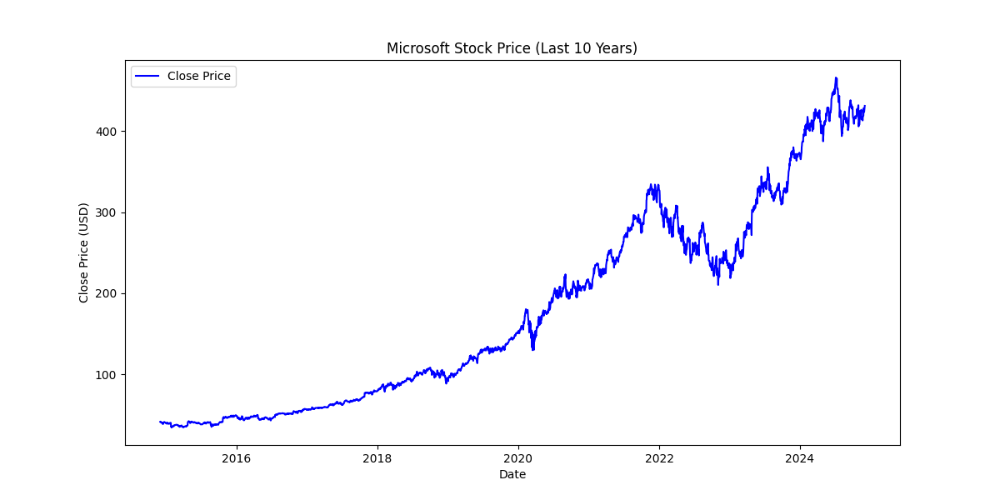
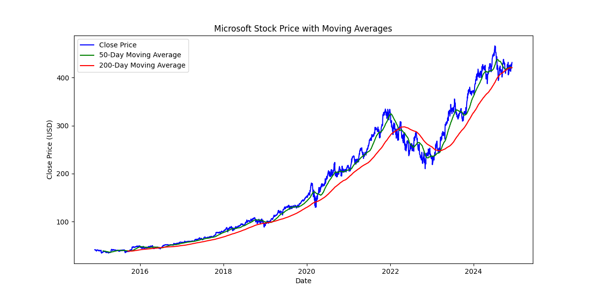
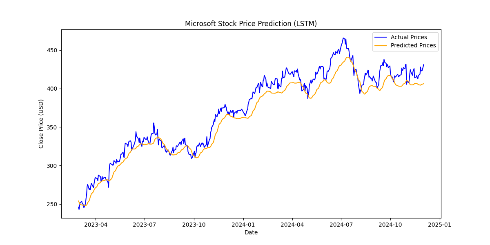

# Stock Price Prediction Using LSTM

This project uses Python to analyze and predict stock prices based on historical data. It focuses on:

- Analyzing 10 years of stock data using the `yfinance` library.
- Building a deep learning model (LSTM) to predict future stock prices.
- Visualizing the actual vs predicted stock prices.

## Features

1. **Data Analysis**: Includes moving averages for better trend analysis.
2. **Deep Learning Prediction**: Predicts stock prices using LSTM.
3. **Visualizations**: Plots closing prices, moving averages, and prediction trends.

## Output Visualizations

### Stock Closing Price Over Time

### Moving Averages

### Predicted vs Actual Stock Prices

## Results

The model achieved the following metrics:

- **Mean Squared Error (MSE)**: 162.69
- **Mean Absolute Error (MAE)**: 10.39
- **R² Score**: 0.943

These results demonstrate that the LSTM model effectively predicts stock prices with high accuracy.

## Key Takeaways

- The model is capable of forecasting future stock prices based on historical trends.
- Predicted prices closely align with actual values, making the model suitable for financial analysis.

_Disclaimer: This project is for educational purposes only and should not be used for financial decision-making._
